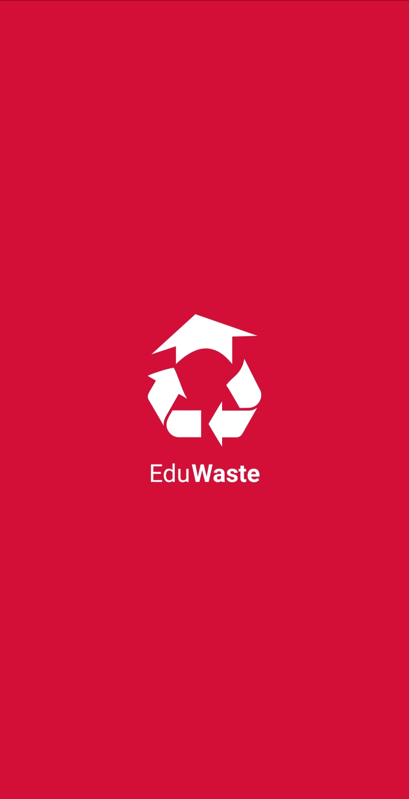

# Dicoding Submission Android Pemula
Submission - Belajar membuat aplikasi android untuk pemula dicoding

## Project Name
EduWaste - This project was created to fulfill the submission [Belajar Membuat Aplikasi Android untuk Pemula](https://www.dicoding.com/academies/51).

## Screenshots
   
     
## Download
Clone this repository to your Android Studio
```
https://github.com/rhinotrivaldi/EduWaste.git
```
     
## Author
#### Rhino Trivaldi A
